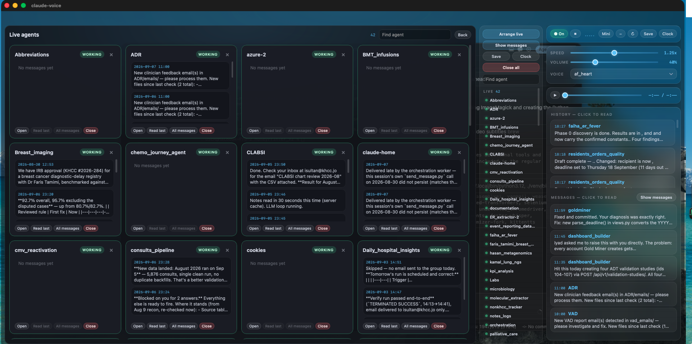
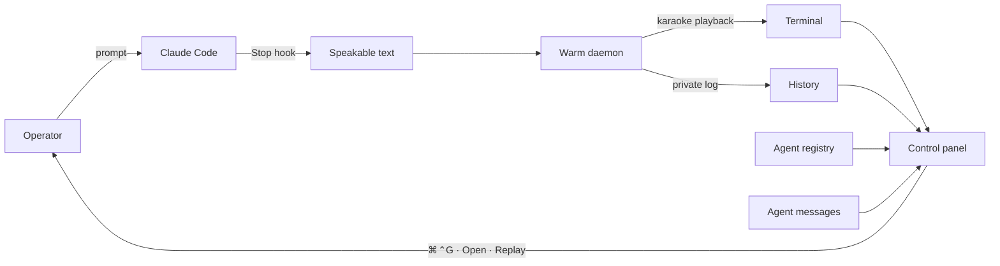
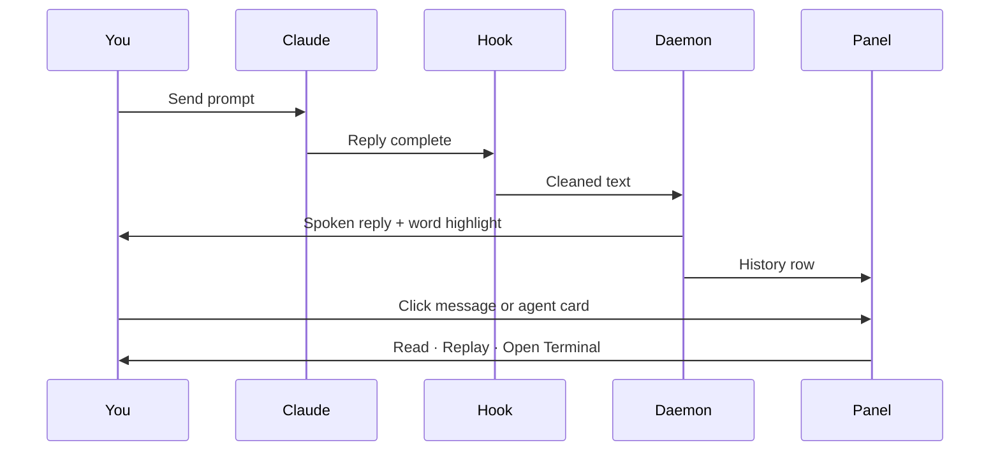

# claude-voice

**Spoken replies for Claude Code — and a live operations panel for every agent on the machine.**

[](LICENSE)
[](https://www.python.org)
[](integrations/hammerspoon-panel.lua)

When a Claude session finishes a reply, claude-voice speaks it and highlights each word in the Terminal. A floating panel then shows every running agent, the last thing each one said, and one-click access to that Terminal.

<p align="center">
  
</p>

<p align="center"><em>Arrange live — one card per running Claude. Open the Terminal, replay the last note, or close the session. The column on the right is always available: speech controls, History, Messages, Live.</em></p>

Toggle the panel with **⌘⌃G**.

---

## Why it exists

Claude Code already accepts voice. It does not speak back, and it does not show dozens of parallel sessions as a single picture.

This project does both: local-first speech after every Stop hook, and an operations view over the agents that are actually running.

---

## Architecture



Speech stays in-process on this Mac unless you choose a cloud voice. History is written only for this user (`~/.cache/claude-voice/history.jsonl`, mode `600`).



---

## Capabilities

| Speech | Operations |
|---|---|
| Karaoke highlighting in the calling Terminal | Arrange live card grid (A–Z, running agents only) |
| Six providers: Kokoro, system, OpenAI, ElevenLabs, Grok, custom | Live / Idle roster with Open on click |
| Warm daemon (~0.6s to first audio after load) | History and agent-to-agent Messages |
| Only the Terminal you just typed in speaks | Replay, Previous, Next, Open, Close on a clicked note |
| `/voice` from inside Claude Code | Save / restore session snapshots; Close all |

Green **Working** (or a green Live dot) means a `claude` process is still running in that folder. Open reuses an existing Terminal of that name. Close types `exit` in that session only.

---

## Install

```bash
git clone https://github.com/IyadSultan/claude-voice
cd claude-voice
python3 -m venv .venv && .venv/bin/pip install -e ".[local]"
.venv/bin/claude-voice setup
```

Restart Claude Code. Replies are spoken automatically. Confirm with `/voice status`.

Cloud-only (no local model):

```bash
.venv/bin/pip install -e .
.venv/bin/claude-voice provider openai
.venv/bin/claude-voice key openai sk-...
```

### macOS panel

```bash
brew install --cask hammerspoon
```

Grant Accessibility under **System Settings → Privacy & Security**. Add this line to `~/.hammerspoon/init.lua`:

```lua
dofile(os.getenv("HOME") .. "/code/claude-voice/integrations/hammerspoon-panel.lua")
```

Reload Hammerspoon, then press **⌘⌃G**. Point `CLAUDE_VOICE_BIN` at your install if it is not `~/.local/bin/claude-voice`.

---

## Panel reference

| Control | Action |
|---|---|
| On / Off | Speech for every Terminal |
| Stop / pause / seek | Current utterance |
| Speed · Volume · Voice | Follows the active theme |
| Arrange live | Card grid beside the panel |
| Show messages | Who wrote to whom; click an edge to read |
| Save / Clock | Snapshot running Terminals; restore after reboot |
| Close all | Exit every live Claude, then close those windows (confirm first) |
| History | Spoken replies — read, replay, or open the agent |
| Messages | Latest agent-to-agent notes |
| Live / Idle | Full roster; click a name to focus that Terminal |

---

## Providers

| Provider | Role | Key | Word sync |
|---|---|---|---|
| `kokoro` (default) | Local 82M model, CPU, private | — | estimated |
| `system` | macOS `say` / espeak | — | estimated |
| `openai` | `gpt-4o-mini-tts` | `OPENAI_API_KEY` | estimated |
| `elevenlabs` | Hosted TTS | `ELEVENLABS_API_KEY` | character timestamps |
| `grok` | xAI TTS | `XAI_API_KEY` | estimated |
| `custom` | Any OpenAI-compatible `/audio/speech` | optional | estimated |

```bash
claude-voice provider elevenlabs
claude-voice key elevenlabs <key>
```

MP3 voices need `ffmpeg` (`brew install ffmpeg`).

---

## Command line

```
/voice on|off|mute|status|provider <name>|voice <name>|speed <x>|theme <name>
```

```bash
claude-voice setup | uninstall | on | off | toggle | mute | unmute | status
claude-voice provider <name> | voice <name> | voices | key <prov> <key>
claude-voice speed 1.2 | volume 80% | theme aurora
claude-voice history | replay [n] | seek <sec> | playpause | clip | stop
claude-voice daemon-status | daemon-stop | doctor | demo
```

Config: `~/.config/claude-voice/config.json` (mode `600` when keys are stored).

---

## Requirements

- Python 3.11+ (3.12 recommended for Kokoro)
- `sounddevice`, `numpy`; `kokoro` for the local voice
- `ffmpeg` for MP3 cloud voices
- macOS + Hammerspoon for the panel
- A true-color terminal (Terminal.app, iTerm2, Kitty, Ghostty, Alacritty)

If PortAudio is missing, the CLI stays up and reports that audio is unavailable.

---

## License

MIT. Speech core originated with [Null-Phnix/claude-voice](https://github.com/Null-Phnix/claude-voice). This repository adds the live-agent panel, history navigation, and session controls.
